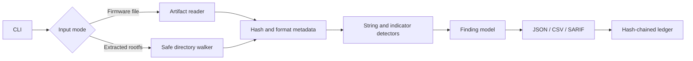

# GHOST-FirmwareAnalyzer

**GHOST-FirmwareAnalyzer** is a standalone, static evidence analyzer for firmware images and already-extracted embedded root filesystems. It is designed for authorized product security reviews, incident response, firmware triage, and reproducible engineering analysis.

The repository intentionally uses only the Python standard library. It does not call Binwalk, Radare2, Ghidra, YARA, Docker, a Kubernetes cluster, a vendor API, or a cloud service. The analyzer reads the supplied file or directory, records cryptographic provenance, identifies observable metadata and strings, produces normalized findings, and never executes extracted code or opens a network connection.

> A static indicator is evidence to investigate, not proof of a hardware backdoor or a vulnerability. Hardware-level claims require controlled board access, boot-chain validation, reproducible-build comparison, and vendor or laboratory evidence.

## Why this repository is different from a single-file scanner

The earlier version exposed a small script with a short README. This version is organized as a maintainable analyzer rather than a single demonstration file. Its core responsibilities are separated into artifact handling, detection rules, report generation, provenance logging, and command-line orchestration.

| Area | Implementation in this repository |
|---|---|
| Input handling | Regular-file validation, size limits, SHA-256 hashing, magic-byte identification, and extracted-rootfs traversal |
| Static analysis | Printable-string extraction, entropy, executable/archive markers, service indicators, protocol markers, and embedded credential indicators |
| Hardware review | Conservative indicators for debug interfaces, secure-boot paths, and backdoor-related terms; no claim of physical certainty |
| Evidence | Finding rule, severity, confidence, source, location, evidence excerpt, remediation, and tags |
| Outputs | JSON 1.0.0, CSV, SARIF 2.1.0, and append-only hash-chained JSONL ledger |
| Safety boundary | Static-only operation; no execution, emulation, network probing, payload generation, persistence, or credential recovery |
| Dependencies | Python standard library only |
| Automation | GitHub Actions compilation, tests, and tracked-file private-key check |

## Capabilities

### Firmware image analysis

The `--firmware` mode analyzes a supplied binary or image as bytes. It records the absolute input path, size, SHA-256 digest, UTC analysis time, detected magic signature, entropy, printable-string count, and findings derived from observable content. Large inputs are bounded by a configurable limit so that a workstation does not unexpectedly consume unbounded memory.

The current format inventory recognizes common ELF, PE/COFF, Mach-O, archive, and compression signatures. Recognition is an observation only; it is not a claim that the file is safe, signed, or correctly parsed as a complete filesystem image.

### Extracted root filesystem analysis

The `--rootfs` mode accepts a directory that the operator has already extracted through an approved process. It walks regular files without following symbolic links, records per-file SHA-256 metadata, applies per-file and total-file limits, and scans printable content. It does not mount the filesystem, chroot into it, load shared libraries, invoke interpreters, or execute binaries.

### Protocol and service indicators

The analyzer reports observable markers such as Telnet daemon names, Dropbear references, HTTP URLs, MQTT references, TFTP markers, embedded management-bus strings, and raw packet interface names. These are inventory and review signals. A marker may be a legitimate component, a build artifact, or an unrelated string; each finding includes a confidence field and remediation guidance rather than claiming exploitation.

### Credential and sensitive-material indicators

The analyzer can identify strings associated with default credentials, embedded authorization material, and private-key headers. Evidence is truncated to a bounded excerpt in reports. Operators should treat any confirmed private-key material as compromised, rotate it, and review build provenance. The program does not print secret values as a separate output and does not attempt to recover or use credentials.

### Hardware-backdoor indicators

The analyzer includes conservative static indicators for `JTAG`, `SWD`, test-point or debug-enable strings, signature-verification paths, development debugging tools, and terms such as `backdoor`, `covert channel`, or `magic packet`. These rules are deliberately classified as indicators with low or medium confidence. A string match cannot inspect a chip's undocumented logic, a hidden FPGA path, a modified boot ROM, a supply-chain substitution, or a board-level test configuration.

A defensible hardware investigation should continue with the physical board, debug-fuse state, boot-ROM behavior, firmware signing and rollback policy, reproducible-build comparison, vendor chain-of-custody, and controlled traffic capture. Those activities are outside the scope of a file-only analyzer.

## Repository layout

```text
GHOST-FirmwareAnalyzer/
├── main.py
├── pyproject.toml
├── README.md
├── LICENSE
├── requirements.txt
├── todo.md
├── src/
│   └── ghost_firmware_analyzer/
│       ├── __init__.py
│       ├── analyzer.py
│       ├── artifacts.py
│       ├── cli.py
│       ├── detectors.py
│       ├── ledger.py
│       ├── models.py
│       └── reporting.py
├── tests/
│   └── test_analyzer.py
├── docs/
│   ├── architecture.md
│   ├── cli-reference.md
│   ├── detection-methodology.md
│   └── reporting.md
└── .github/
    └── workflows/
        └── ci.yml
```

## Requirements and installation

The analyzer requires Python 3.10 or newer and has no runtime package dependencies. A virtual environment is optional because the runtime uses the standard library only.

```bash
git clone https://github.com/GhostSy1/GHOST-FirmwareAnalyzer.git
cd GHOST-FirmwareAnalyzer
python3 --version
python3 -m compileall -q main.py src tests
```

`requirements.txt` is intentionally empty apart from the file header because the application does not rely on third-party runtime packages. The repository can therefore be copied to an offline review workstation after the source and interpreter have been verified.

## Command-line use

### Analyze one firmware image

```bash
python3 main.py \
  --firmware ./evidence/router-firmware.bin \
  --json ./reports/router.json \
  --csv ./reports/router.csv \
  --sarif ./reports/router.sarif \
  --ledger ./reports/audit-ledger.jsonl
```

The command reads the target, creates the requested reports, and appends a hash-chained provenance record. It does not modify the target.

### Analyze an extracted root filesystem

```bash
python3 main.py \
  --rootfs ./evidence/rootfs \
  --json ./reports/rootfs.json \
  --sarif ./reports/rootfs.sarif \
  --max-files 100000 \
  --max-file-bytes 16777216
```

### Verify the local audit ledger

```bash
python3 main.py \
  --verify-ledger \
  --ledger ./reports/audit-ledger.jsonl
```

A successful verification confirms the internal previous-hash chain and each record hash. It does not prove that the original target was authentic; authenticity depends on the acquisition and chain-of-custody process used before analysis.

### Non-interactive operation

CI and automation should always provide `--firmware` or `--rootfs`. If neither is supplied from a terminal, the CLI asks for the mode and path interactively. `--no-clear` disables terminal clearing for log collectors.

```bash
python3 main.py --no-clear --firmware ./evidence/image.bin --json report.json
python3 main.py --help
```

## Finding model

Every finding has a stable rule identifier and contains the following fields.

| Field | Meaning |
|---|---|
| `rule_id` | Stable identifier such as `FW-SVC-TELNET` or `FW-HW-JTAG` |
| `title` | Human-readable description of the observation |
| `severity` | `info`, `low`, `medium`, `high`, or `critical` |
| `confidence` | Confidence in the static observation, separate from severity |
| `description` | What was observed and what it does not prove |
| `evidence` | Bounded excerpt from the analyzed content |
| `source` | `firmware-image`, `rootfs-file`, `file-signature`, or another analyzer source |
| `location` | Relative rootfs path when the finding came from a directory |
| `remediation` | Review or hardening action appropriate to the observation |
| `tags` | Searchable categories such as `protocol` or `hardware-indicator` |

The risk score is a transparent triage score capped at 100. It is not a CVSS score, exploitability prediction, or vendor severity. The report includes the underlying severity counts so the score can be recalculated or replaced by an organization's own risk method.

## Output formats

JSON is the canonical machine-readable report. CSV is useful for spreadsheet review. SARIF 2.1.0 can be uploaded to compatible code-scanning workflows. The ledger is an append-only JSONL file in which each record contains the previous record hash, the report digest, target, finding count, and its own record hash.

The report records three important safety properties:

```json
{
  "execution_performed": false,
  "network_access_performed": false,
  "symlinks_followed": false
}
```

These values describe this program's behavior during that run. They do not describe how the input was acquired or how another tool may have processed it.

## Architecture



The architecture is intentionally deterministic at the rule level. There is no hidden network lookup, model call, payload selection, active probing, or external command invocation. This makes the evidence path easier to audit and repeat.

## Detection methodology

Rules are grouped by the kind of evidence they observe rather than by a claim that they can prove.

| Group | Examples | Typical interpretation |
|---|---|---|
| Service | Telnet, Dropbear, shell execution | Component inventory and exposure review |
| Credential | Default credential terms, `authorized_keys`, private-key headers | Possible embedded secret requiring confirmation and rotation |
| Protocol | HTTP, MQTT, TFTP, UBUS, raw socket markers | Communication and management-plane review |
| Hardware indicator | JTAG, SWD, debug enable, secure boot, backdoor terms | Triage clue requiring hardware and provenance validation |
| Format | ELF, PE, Mach-O, archive, compression markers | File inventory and next-step selection |

A positive match is not automatically a vulnerability. For example, Dropbear may be an expected SSH server, and a secure-boot string does not demonstrate a valid chain of trust. Analysts should preserve the report, inspect the relevant component, and collect the additional evidence required for a conclusion.

## Testing

The test suite uses Python's built-in `unittest` framework. It validates hashing, format detection, static indicator extraction, rootfs symlink handling, report serialization, and ledger verification.

```bash
python3 -m unittest discover -s tests -v
```

The tests use temporary files created during the test process to exercise the parser. They are parser fixtures, not security evidence and not findings presented as production observations. Production reports must be generated from operator-supplied firmware or rootfs inputs.

## CI policy

The included workflow compiles the source, runs the unit and integration tests, and checks tracked text files for private-key headers. It does not upload analyzed artifacts, execute firmware, or contact a target. GitHub's SARIF-compatible code scanning can consume the generated report when an organization has configured that workflow.

## Operational boundaries

This project is intended for authorized analysis of firmware and extracted files. It does not provide exploitation, persistence, evasion, credential theft, payload generation, remote access, network scanning, or automatic modification of firmware. It does not replace vendor tooling, a disassembler, a reverse-engineering suite, a hardware security lab, or a formal secure-boot assessment.

The analyzer also does not claim to detect every vulnerability. It does not resolve package versions to CVEs, emulate a CPU, disassemble every instruction set, prove cryptographic correctness, inspect hidden silicon logic, or determine whether a vendor intentionally included a covert function. Such claims would require evidence that is not present in a generic file-only input.

## Evidence handling guidance

Work from a read-only copy whenever possible. Record how the image was acquired, who provided it, the original filename, the expected digest, the device and version, and the chain of custody. Compare the analyzer's SHA-256 value with an independent acquisition record. Store reports and ledger files separately from the input image and protect them with the organization's normal access controls.

Do not commit firmware images, private keys, customer data, credentials, or proprietary crash dumps to this repository. The included reports are designed to store bounded evidence excerpts, but operators remain responsible for reviewing outputs before sharing them.

## References

[1]: https://csrc.nist.gov/pubs/sp/800/193/final "NIST SP 800-193: Platform Firmware Resiliency Guidelines"
[2]: https://sarifweb.azurewebsites.net/ "Static Analysis Results Interchange Format (SARIF)"
[3]: https://docs.github.com/en/code-security/code-scanning/integrating-with-code-scanning/uploading-a-sarif-file-to-github "GitHub documentation: Uploading a SARIF file"

## License

This repository is distributed under the MIT License. See `LICENSE` for the full text.

## Engineering and release baseline

This repository is maintained as part of the Ghost-SY1 security engineering portfolio. The project is intended for authorized assessment, analysis, or defensive engineering, according to the concrete behavior implemented in the source tree. Results must be derived from operator-supplied inputs and should be reviewed against the documented limitations before they are used in a decision.

### Repository map

| Path | Purpose |
|---|---|
| `README.md` | Installation, usage, scope, and limitations |
| `docs/` | Detailed operational and architectural documentation |
| `tests/` | Reproducible checks for implemented behavior |
| `.github/workflows/` | Automated quality and release checks |
| `SECURITY.md` | Vulnerability reporting and release hygiene |
| `CONTRIBUTING.md` | Contribution and review requirements |

### Verification

Run the repository-specific command documented above, then run the checks in `.github/workflows/quality.yml` locally where the required runtime is available. Do not interpret a passing syntax check as proof that every deployment or security decision is correct.

### Responsible use

Use only with explicit authorization. Do not commit credentials, private keys, customer data, or raw engagement artifacts. The repository does not provide a guarantee that an observation is a vulnerability; analysts must preserve evidence and validate conclusions independently.
